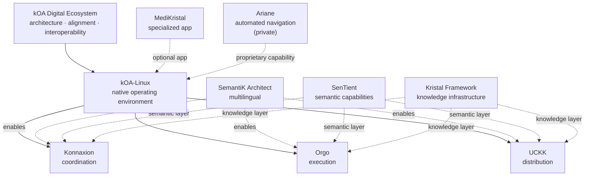

# Réjean McCormick

**Socio-technical architect building kOA — a governable digital ecosystem for turning knowledge into coordinated action.**

I design infrastructure for collective intelligence: systems that help people and institutions **learn, deliberate, decide, execute, and preserve memory** without losing legitimacy, traceability, or operational clarity.

> **kOA is not a single app.**  
> It is an ecosystem built around **kOA-Linux**, with three principal applications — **Konnaxion, Orgo, and UCKK** — plus semantic, multilingual, knowledge, and automation capabilities that can plug into the same architecture.

---

## Start here

| Layer | Repository | Purpose |
|---|---|---|
| **Operating environment** | [**kOA-Linux**](https://github.com/Rejean-McCormick/kOA-Linux-Koali) | Native operating environment that integrates the kOA applications |
| **Core app** | [**Konnaxion**](https://github.com/Rejean-McCormick/Konnaxion) | Public coordination, shared knowledge, learning, research, consultation |
| **Core app** | [**Orgo**](https://github.com/Rejean-McCormick/Orgo) | Operational execution, routing, ownership, escalation, organisational memory |
| **Core app** | [**UCKK**](https://github.com/Rejean-McCormick/UCKK) | Distribution platform and core application |
| **Architecture** | [**kOA Digital Ecosystem**](https://github.com/Rejean-McCormick/kOA-Digital-Ecosystem) | Alignment, interoperability, contracts, and system-of-systems architecture |

---

## kOA at a glance

The operating loop is:

**knowledge → deliberation → decision → execution → institutional memory**

The goal is not to build one monolithic platform. The goal is to make the seams between systems **explicit, governable, auditable, and reusable**.

---

## Core systems

### kOA-Linux

**kOA-Linux is the native operating environment for the ecosystem.**

Its role is to make the main kOA applications feel like parts of one coherent system rather than unrelated tools. It provides the environment in which integration, navigation, identity, workflows, knowledge, and supporting services can come together.

**Repository:** [Rejean-McCormick/kOA-Linux-Koali](https://github.com/Rejean-McCormick/kOA-Linux-Koali)

### Konnaxion

**Konnaxion is the public coordination layer.**

It brings together learning, research, consultations, shared civic knowledge, reusable practices, and public-facing coordination.

Related repositories:

- [Konnaxion-SecurityDiag](https://github.com/Rejean-McCormick/Konnaxion-SecurityDiag)
- [Konnaxion-Worlds](https://github.com/Rejean-McCormick/Konnaxion-Worlds)
- [Konnaxion-LevelUpDiag](https://github.com/Rejean-McCormick/Konnaxion-LevelUpDiag)
- [Konnaxion-Capsule-Manager](https://github.com/Rejean-McCormick/Konnaxion-Capsule-Manager)
- [Konnaxion-Ashoka-Systems-Change-Dossier](https://github.com/Rejean-McCormick/Konnaxion-Ashoka-Systems-Change-Dossier)

### Orgo

**Orgo is the execution backbone.**

It converts signals and decisions into structured work: cases, tasks, routing, ownership, escalation, review cycles, and operational memory.

Related repositories:

- [Orgo-Worlds](https://github.com/Rejean-McCormick/Orgo-Worlds)
- [LevelUpDiag-Orgo](https://github.com/Rejean-McCormick/LevelUpDiag-Orgo)

### UCKK

**UCKK is a principal application and the ecosystem's current distribution platform.**

It sits alongside Konnaxion and Orgo as one of the three main applications integrated into the broader kOA environment.

Related repository:

- [UCKK-Assets](https://github.com/Rejean-McCormick/UCKK-Assets)

---

## Emerging capabilities

These systems are less mature today than Konnaxion, Orgo, and UCKK, but they are intended to become important cross-cutting capabilities.

### SemantiK Architect

**Multilingual architecture and structured language generation.**

SemantiK is designed to support deterministic, auditable, label-preserving multilingual workflows across the ecosystem.

- [SemantiK-Architect](https://github.com/Rejean-McCormick/SemantiK-Architect)
- [SemantiK-Architect-GF-Zone-Auditor](https://github.com/Rejean-McCormick/SemantiK-Architect-GF-Zone-Auditor)
- [Grammatical-Framework-audit](https://github.com/Rejean-McCormick/Grammatical-Framework-audit)
- [Grammatical-Framework-Albanian](https://github.com/Rejean-McCormick/Grammatical-Framework-Albanian)

### SenTient

**Semantic capabilities for the ecosystem.**

[SenTient](https://github.com/Rejean-McCormick/SenTient) is part of the emerging semantic / multilingual stack and is intended to help preserve meaning across systems and representations.

### Kristal

**Structured knowledge infrastructure.**

The [Kristal Framework](https://github.com/Rejean-McCormick/Kristal-Framework) explores portable, structured, provenance-aware knowledge artifacts that can preserve meaning, status, certainty, scope, and traceability better than ordinary documents alone.

Related work:

- [Kristal-Farms](https://github.com/Rejean-McCormick/Kristal-Farms)
- [MediKristal](https://github.com/Rejean-McCormick/MediKristal) — specialized application that can join the ecosystem

### Ariane

**Automated navigation capability.**

Ariane is part of the kOA architecture but is **not open source**. Its implementation therefore does not appear in the public repository map.

---

## Architecture and alignment

### [kOA Digital Ecosystem](https://github.com/Rejean-McCormick/kOA-Digital-Ecosystem)

This repository is the **canonical architecture map** for how the applications fit together.

Its purpose is to document:

- boundaries between systems
- integration contracts
- data and knowledge flows
- shared conventions
- governance assumptions
- cross-application workflows
- the relationship between public, private, optional, and emerging components

It should answer one question clearly:

> **How do all kOA systems work together without collapsing into one monolith?**

---

## Design principles

### Governability over engagement

Systems should remain understandable, contestable, and accountable rather than optimizing only for activity.

### Deterministic-first

Critical flows should be reproducible and inspectable. AI can assist, but it should not become hidden authority or the only path to correctness.

### Policy-scoped integrity

Verified, uncertain, disputed, revoked, fictional, symbolic, and provisional material should remain distinguishable.

### Verification before activation

Knowledge packs, runtime artifacts, and operational outputs should become active only under explicit policy conditions, with safe degradation, rollback, auditability, and visible status.

### System of systems, not monolith

Strong architecture comes from composable systems with explicit seams.

### Institutional memory as infrastructure

Decisions, workflows, evidence, and knowledge should compound over time instead of disappearing at the end of each cycle.

### Public-good orientation

The objective is not only efficiency. It is stronger collective capacity: better learning, deliberation, execution, continuity, and accountability.

---

## Repository map

### Core

- [kOA-Digital-Ecosystem](https://github.com/Rejean-McCormick/kOA-Digital-Ecosystem)
- [kOA-Linux-Koali](https://github.com/Rejean-McCormick/kOA-Linux-Koali)
- [Konnaxion](https://github.com/Rejean-McCormick/Konnaxion)
- [Orgo](https://github.com/Rejean-McCormick/Orgo)
- [UCKK](https://github.com/Rejean-McCormick/UCKK)

### Konnaxion

- [Konnaxion-SecurityDiag](https://github.com/Rejean-McCormick/Konnaxion-SecurityDiag)
- [Konnaxion-Worlds](https://github.com/Rejean-McCormick/Konnaxion-Worlds)
- [Konnaxion-LevelUpDiag](https://github.com/Rejean-McCormick/Konnaxion-LevelUpDiag)
- [Konnaxion-Capsule-Manager](https://github.com/Rejean-McCormick/Konnaxion-Capsule-Manager)
- [Konnaxion-Ashoka-Systems-Change-Dossier](https://github.com/Rejean-McCormick/Konnaxion-Ashoka-Systems-Change-Dossier)

### Orgo

- [Orgo-Worlds](https://github.com/Rejean-McCormick/Orgo-Worlds)
- [LevelUpDiag-Orgo](https://github.com/Rejean-McCormick/LevelUpDiag-Orgo)

### UCKK

- [UCKK-Assets](https://github.com/Rejean-McCormick/UCKK-Assets)

### Language & semantics

- [SemantiK-Architect](https://github.com/Rejean-McCormick/SemantiK-Architect)
- [SenTient](https://github.com/Rejean-McCormick/SenTient)
- [SemantiK-Architect-GF-Zone-Auditor](https://github.com/Rejean-McCormick/SemantiK-Architect-GF-Zone-Auditor)
- [Grammatical-Framework-audit](https://github.com/Rejean-McCormick/Grammatical-Framework-audit)
- [Grammatical-Framework-Albanian](https://github.com/Rejean-McCormick/Grammatical-Framework-Albanian)

### Knowledge & specialized apps

- [Kristal-Framework](https://github.com/Rejean-McCormick/Kristal-Framework)
- [MediKristal](https://github.com/Rejean-McCormick/MediKristal)
- [Kristal-Farms](https://github.com/Rejean-McCormick/Kristal-Farms)

### Platform & documentation

- [Konductor](https://github.com/Rejean-McCormick/Konductor)
- [initkoa-docs](https://github.com/Rejean-McCormick/initkoa-docs)
- [HomePage-initkoa.org](https://github.com/Rejean-McCormick/HomePage-initkoa.org)

### Labs / exploratory work

These repositories are intentionally separated from the main product map:

- [Koali-Spaces](https://github.com/Rejean-McCormick/Koali-Spaces)
- [Koali-Control-Panel](https://github.com/Rejean-McCormick/Koali-Control-Panel)
- [Koali-Scenario-Mosaic](https://github.com/Rejean-McCormick/Koali-Scenario-Mosaic)
- [Science-Silk-Road-Koali](https://github.com/Rejean-McCormick/Science-Silk-Road-Koali)
- [Partners-for-Public-Good-Pressure-Test-Koali](https://github.com/Rejean-McCormick/Partners-for-Public-Good-Pressure-Test-Koali)
- [LevelUpDiag-kOA-Linux](https://github.com/Rejean-McCormick/LevelUpDiag-kOA-Linux)

---

## Why this work exists

Institutions increasingly face several failures at once:

- information overload
- fragmented coordination
- loss of institutional memory
- public mistrust
- opaque automation
- brittle workflows
- knowledge that cannot be reused safely

The answer is not simply more content, more dashboards, or AI everywhere.

The problem space I work in is **governable infrastructure**:

- systems that preserve meaning
- systems that make decisions legible
- systems that connect deliberation to execution
- systems that produce reusable institutional memory
- systems that keep uncertainty, disagreement, provenance, and authority visible
- systems that remain usable under stress, contestation, or degraded conditions

---

## Writing, research, and public work

- [initkoa.org](https://initkoa.org)
- [Medium](https://medium.com/@boatbuilder610)
- [Google Scholar](https://scholar.google.com/citations?user=oVZ3n9kAAAAJ&hl=en)
- [ORCID](https://orcid.org/0009-0001-2086-854X)
- [PhilPeople](https://philpeople.org/profiles/rejean-mccormick)
- [Amazon author page](https://www.amazon.ca/stores/author/B0G3B7DQWG?ingress=0)
- [LinkedIn](https://www.linkedin.com/in/r%C3%A9jean-mccormick-51403a37b/)
- [YouTube](https://www.youtube.com/@KingKlown-XYZ/playlists)

---

## Contact

- **Email:** [rejean.mccormick@initkoa.org](mailto:rejean.mccormick@initkoa.org)
- **GitHub:** [Rejean-McCormick](https://github.com/Rejean-McCormick)
- **Hub:** [initkoa.org](https://initkoa.org)
