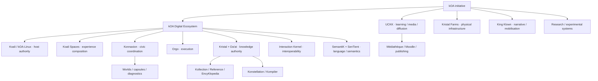

# kOA Ecosystem Map

**Systems, repositories, authority boundaries, public surfaces and current implementation roots.**

This repository is a navigation map of the **kOA ecosystem**. It is intentionally organized around systems and repositories rather than around a person. The authoritative implementation details remain in the repositories that own them; this page connects those sources without collapsing their authority boundaries.

## Start here

- **Canonical machine-readable system map:** [kOA-Digital-Ecosystem](https://github.com/Rejean-McCormick/kOA-Digital-Ecosystem)
- **Architecture/reference corpus:** [kOA Reference Corpus](reference-corpus/README.md)
- **Public hub:** [initkoa.org](https://initkoa.org)
- **Public coordination:** [konnaxion.com](https://konnaxion.com)
- **Learning / diffusion:** [uckk.org](https://uckk.org)
- **Scenario map:** [Koali Scenario Mosaic](https://koaliscenariomosaic.netlify.app/en/uses/)

> **Map rule:** repository presence does not automatically imply architectural authority, runtime activation, or membership in the kOA Digital Ecosystem. Support, research, content, diagnostics and external dependencies remain explicitly separated.

---

## Ecosystem at a glance

---

## Core digital architecture

| System | Function | Repositories |
|---|---|---|
| **kOA Digital Ecosystem** | Canonical ecosystem map and authority-aware system model | [kOA-Digital-Ecosystem](https://github.com/Rejean-McCormick/kOA-Digital-Ecosystem) |
| **Koali / kOA-Linux** | Host authority, identity/trust, policy, privileges, lifecycle, resilience and local continuity | [kOA-Linux-Koali](https://github.com/Rejean-McCormick/kOA-Linux-Koali) · [Koali-Spaces](https://github.com/Rejean-McCormick/Koali-Spaces) · [Koali-Control-Panel](https://github.com/Rejean-McCormick/Koali-Control-Panel) · [LevelUpDiag-kOA-Linux](https://github.com/Rejean-McCormick/LevelUpDiag-kOA-Linux) |
| **Interaction Kernel** | Distributed interoperability: commands, queries, events, receipts, artifacts and reconciliation | [Interaction-Kernel](https://github.com/Rejean-McCormick/Interaction-Kernel) |
| **Konfid** | Security/control-plane functions | [Konfid](https://github.com/Rejean-McCormick/Konfid) |
| **Konductor** | Orchestration / development tooling | [Konductor](https://github.com/Rejean-McCormick/Konductor) |

## Civic coordination and execution

| System | Function | Repositories |
|---|---|---|
| **Konnaxion** | Consultation, deliberation, expertise, coordination, collective knowledge and civic surfaces | [Konnaxion](https://github.com/Rejean-McCormick/Konnaxion) · [Konnaxion-Worlds](https://github.com/Rejean-McCormick/Konnaxion-Worlds) · [Konnaxion-Capsule-Manager](https://github.com/Rejean-McCormick/Konnaxion-Capsule-Manager) |
| **Konnaxion assurance** | Security, qualification and diagnostic evidence | [Konnaxion-SecurityDiag](https://github.com/Rejean-McCormick/Konnaxion-SecurityDiag) · [Konnaxion-LevelUpDiag](https://github.com/Rejean-McCormick/Konnaxion-LevelUpDiag) |
| **Orgo** | Signal → case → workflow → task → result → evidence | [Orgo](https://github.com/Rejean-McCormick/Orgo) · [Orgo-Worlds](https://github.com/Rejean-McCormick/Orgo-Worlds) · [LevelUpDiag-Orgo](https://github.com/Rejean-McCormick/LevelUpDiag-Orgo) |
| **Voting / decision research** | Deterministic vote-result artifacts and decision-system experiments | [VotingMachine](https://github.com/Rejean-McCormick/VotingMachine) |

## Knowledge, Kristal and semantic infrastructure

| System | Function | Repositories |
|---|---|---|
| **Kristal** | Structured claims, provenance, uncertainty, validation state, identity and portable knowledge | [Kristal-Framework](https://github.com/Rejean-McCormick/Kristal-Framework) · [Kristal-Kollection](https://github.com/Rejean-McCormick/Kristal-Kollection) · [Kristal-Reference](https://github.com/Rejean-McCormick/Kristal-Reference) |
| **EncyKlopedia** | Source discovery, acquisition, extraction and evidence handoff | [EncyKlopedia](https://github.com/Rejean-McCormick/EncyKlopedia) |
| **Konstellation** | Kristal-oriented navigation / presentation layer | [Konstellation](https://github.com/Rejean-McCormick/Konstellation) |
| **MediKristal** | Domain/application layer around Kristal | [MediKristal](https://github.com/Rejean-McCormick/MediKristal) · [MediKristal-LevelUpDiag-](https://github.com/Rejean-McCormick/MediKristal-LevelUpDiag-) |
| **Omni-Wiki** | Wiki / knowledge presentation experiments | [Omni-Wiki](https://github.com/Rejean-McCormick/Omni-Wiki) |
| **SemantiK Architect** | Structured multilingual generation and language engineering | [SemantiK-Architect](https://github.com/Rejean-McCormick/SemantiK-Architect) · [SemantiK_Runtime_Orchestrator](https://github.com/Rejean-McCormick/SemantiK_Runtime_Orchestrator) · [LevelUpDiag_SemantiK_Architect](https://github.com/Rejean-McCormick/LevelUpDiag_SemantiK-Architect) |
| **SenTient** | Semantic interpretation and relation resolution | [SenTient](https://github.com/Rejean-McCormick/SenTient) |

## Learning, media and public diffusion

| System | Function | Repositories / surfaces |
|---|---|---|
| **UCKK** | Learning, challenges, assemblies, archives, reporting and public diffusion | [UCKK](https://github.com/Rejean-McCormick/UCKK) · [UCKK-Assets](https://github.com/Rejean-McCormick/UCKK-Assets) · [UCKK-Ops-Console](https://github.com/Rejean-McCormick/UCKK-Ops-Console) · [uckk.org](https://uckk.org) |
| **Médiathèque kOA** | Media/document curation, publication and content delivery | Current local implementations are tracked in the Kristal repository registry; public remote not yet indexed for the active implementation. |

## Narrative, culture and communication

| System | Function | Repositories |
|---|---|---|
| **King Klown** | Narrative / cultural mobilisation; not an implementation authority | [King-Klown-Canon](https://github.com/Rejean-McCormick/King-Klown-Canon) · [HELLO-WORLD-Autopsie-d-un-Clown-Royal](https://github.com/Rejean-McCormick/HELLO-WORLD-Autopsie-d-un-Clown-Royal) · [Omni-Wiki-Rejean-King-Klown](https://github.com/Rejean-McCormick/Omni-Wiki-Rejean-King-Klown) |
| **Books / documentary corpus** | Long-form research and narrative material | [Book-Civilizational-Coherence](https://github.com/Rejean-McCormick/Book-Civilizational-Coherence) · [Book-Colin-Row](https://github.com/Rejean-McCormick/Book-Colin-Row) |

## Physical infrastructure and deployment research

| System | Function | Repositories |
|---|---|---|
| **Kristal Farms** | Energy, compute, fibre, useful heat and resilient local infrastructure | [Kristal-Farms](https://github.com/Rejean-McCormick/Kristal-Farms) |
| **Koali Scenario Mosaic** | Scenario atlas / system-use mapping | [Koali-Scenario-Mosaic](https://github.com/Rejean-McCormick/Koali-Scenario-Mosaic) |

## Research, pressure-tests and experimental branches

| Repository / family | Scope |
|---|---|
| [Power-Dynamics](https://github.com/Rejean-McCormick/Power-Dynamics) | Power, counterpower, routing, conversion and governance analysis. |
| [Science-Silk-Road-Koali](https://github.com/Rejean-McCormick/Science-Silk-Road-Koali) | Research/diffusion bridge across scientific and institutional contexts. |
| [Pi-Theory](https://github.com/Rejean-McCormick/Pi-Theory) | Independent speculative/research program; explicitly separate from MathChallenges. |
| [Ame-Artificielle](https://github.com/Rejean-McCormick/Ame-Artificielle) | Experimental identity / soul-graph research with explicit safety separation. |
| [Projet-ORPHEE-Walk-Straight](https://github.com/Rejean-McCormick/Projet-ORPHEE-Walk-Straight) | Applied learning / rehabilitation program research. |
| [Partners-for-Public-Good-Pressure-Test-Koali](https://github.com/Rejean-McCormick/Partners-for-Public-Good-Pressure-Test-Koali) | Adversarial pressure-test and evidence discipline. |
| [Konnaxion-Ashoka-Systems-Change-Dossier](https://github.com/Rejean-McCormick/Konnaxion-Ashoka-Systems-Change-Dossier) | Systems-change fit dossier; support evidence, not runtime authority. |
| [Freeze-Vote-Rebuild-Operational-Peace-Framework](https://github.com/Rejean-McCormick/Freeze-Vote-Rebuild-Operational-Peace-Framework) | Verification-first peace/reconstruction framework. |
| [OurAI](https://github.com/Rejean-McCormick/OurAI) | AI-oriented experimental/support work. |

### MathChallenges stack

MathChallenges is **not Pi Theory**. The current local stack contains:

- **Formulator** — research/calculation/validation/proof-generation engine around MathKristal.
- **Kristal Grand Challenges** — persistent workbench and per-challenge Kristal research state.
- **Kristal Math** — global mathematical corpus boundary; promotion is explicit rather than automatic.

Their current local roots are registered in the Kristal ecosystem package; public remotes are not yet indexed there.

---

## Supporting language-engineering ecosystem

The MA-Gustave / GF engineering repositories are **supporting systems, not members of the kOA Digital Ecosystem**. Integration does not transfer authority.

- [Ars-Magna-Lulli](https://github.com/MA-Gustave/Ars-Magna-Lulli) — repository
- [GF_Observatory](https://github.com/MA-Gustave/GF_Observatory) — evidence observatory
- [GF_RGL_AI_Compendium](https://github.com/MA-Gustave/GF_RGL_AI_Compendium) — language engineering compendium
- [GF_Wordbench](https://github.com/MA-Gustave/GF_Wordbench) — repository
- [Grammatical-Framework-audit](https://github.com/Rejean-McCormick/Grammatical-Framework-audit) — audit/tooling bridge
- [Grammatical-Framework-Albanian](https://github.com/Rejean-McCormick/Grammatical-Framework-Albanian) — language resource

---

## Public repository directory

This is the linked public repository inventory currently recorded by the ecosystem registry. For local-only implementations and historical observations, use the canonical `repositories.json` in the kOA Digital Ecosystem package.

| Repository | Boundary | Role |
|---|---|---|
| [Ame-Artificielle](https://github.com/Rejean-McCormick/Ame-Artificielle) | research-adjacent | primary |
| [Book-Civilizational-Coherence](https://github.com/Rejean-McCormick/Book-Civilizational-Coherence) | kOA mapped | research book specification |
| [Book-Colin-Row](https://github.com/Rejean-McCormick/Book-Colin-Row) | kOA mapped | narrative book repository |
| [EncyKlopedia](https://github.com/Rejean-McCormick/EncyKlopedia) | kOA mapped | primary |
| [Freeze-Vote-Rebuild-Operational-Peace-Framework](https://github.com/Rejean-McCormick/Freeze-Vote-Rebuild-Operational-Peace-Framework) | kOA mapped | peace framework |
| [Grammatical-Framework-audit](https://github.com/Rejean-McCormick/Grammatical-Framework-audit) | kOA mapped | repository |
| [Grammatical_Framework-Albanian](https://github.com/Rejean-McCormick/Grammatical-Framework-Albanian) | language support | language resource |
| [HELLO-WORLD-Autopsie-d-un-Clown-Royal](https://github.com/Rejean-McCormick/HELLO-WORLD-Autopsie-d-un-Clown-Royal) | kOA mapped | narrative content project |
| [HomePage-initkoa.org](https://github.com/Rejean-McCormick/HomePage-initkoa.org) | kOA mapped | repository |
| [initkoa-docs](https://github.com/Rejean-McCormick/initkoa-docs) | kOA mapped | repository |
| [interaction_kernel](https://github.com/Rejean-McCormick/Interaction-Kernel) | kOA mapped | primary reference implementation |
| [King-Klown-Canon](https://github.com/Rejean-McCormick/King-Klown-Canon) | kOA mapped | narrative canon |
| [koa-linux](https://github.com/Rejean-McCormick/kOA-Linux-Koali) | kOA mapped | primary platform |
| [kOA_Digital_Ecosystem](https://github.com/Rejean-McCormick/kOA-Digital-Ecosystem) | kOA mapped | canonical system map |
| [Koali-Control-Panel](https://github.com/Rejean-McCormick/Koali-Control-Panel) | kOA mapped | development orchestration |
| [koali-spaces](https://github.com/Rejean-McCormick/Koali-Spaces) | kOA mapped | presentation composition |
| [Koali_Scenario_Mosaic](https://github.com/Rejean-McCormick/Koali-Scenario-Mosaic) | kOA mapped | scenario atlas |
| [Konductor](https://github.com/Rejean-McCormick/Konductor) | kOA mapped | repository |
| [konfid](https://github.com/Rejean-McCormick/Konfid) | kOA mapped | security control plane |
| [Konnaxion](https://github.com/Rejean-McCormick/Konnaxion) | kOA mapped | primary |
| [Konnaxion-Ashoka-Systems-Change-Dossier](https://github.com/Rejean-McCormick/Konnaxion-Ashoka-Systems-Change-Dossier) | kOA support | systems change dossier |
| [Konnaxion-LevelUpDiag](https://github.com/Rejean-McCormick/Konnaxion-LevelUpDiag) | kOA mapped | repository |
| [Konnaxion-SecurityDiag](https://github.com/Rejean-McCormick/Konnaxion-SecurityDiag) | kOA mapped | repository |
| [Konnaxion_Capsule_Manager](https://github.com/Rejean-McCormick/Konnaxion-Capsule-Manager) | kOA mapped | deployment lifecycle manager |
| [Konnaxion_Worlds](https://github.com/Rejean-McCormick/Konnaxion-Worlds) | kOA mapped | world control plane |
| [Konstellation](https://github.com/Rejean-McCormick/Konstellation) | kOA mapped | primary 1 0 rc |
| [Kristal-Farms](https://github.com/Rejean-McCormick/Kristal-Farms) | kOA mapped | primary |
| [Kristal-Framework](https://github.com/Rejean-McCormick/Kristal-Framework) | kOA mapped | repository |
| [Kristal-Kollection](https://github.com/Rejean-McCormick/Kristal-Kollection) | kOA mapped | collection |
| [Kristal-Reference](https://github.com/Rejean-McCormick/Kristal-Reference) | kOA mapped | repository |
| [LevelUpDiag-Koali](https://github.com/Rejean-McCormick/LevelUpDiag-kOA-Linux) | kOA mapped | platform qualification |
| [LevelUpDiag-Kristal](https://github.com/Rejean-McCormick/LevelUpDiag-Kristal) | kOA mapped | repository |
| [LevelUpDiag-Orgo](https://github.com/Rejean-McCormick/LevelUpDiag-Orgo) | kOA mapped | orgo qualification |
| [LevelUpDiag_SemantiK_Architect](https://github.com/Rejean-McCormick/LevelUpDiag_SemantiK-Architect) | kOA mapped | semantik qualification |
| [MediKristal](https://github.com/Rejean-McCormick/MediKristal) | kOA mapped | repository |
| [MediKristal-LevelUpDiag-](https://github.com/Rejean-McCormick/MediKristal-LevelUpDiag-) | kOA mapped | repository |
| [Omni-Wiki](https://github.com/Rejean-McCormick/Omni-Wiki) | kOA mapped | repository |
| [Omni-Wiki-Rejean-King-Klown](https://github.com/Rejean-McCormick/Omni-Wiki-Rejean-King-Klown) | kOA mapped | repository |
| [Orgo](https://github.com/Rejean-McCormick/Orgo) | kOA mapped | primary |
| [Orgo-Worlds](https://github.com/Rejean-McCormick/Orgo-Worlds) | kOA mapped | repository |
| [OurAI](https://github.com/Rejean-McCormick/OurAI) | kOA mapped | repository |
| [Partners-for-Public-Good-Pressure-Test-Koali](https://github.com/Rejean-McCormick/Partners-for-Public-Good-Pressure-Test-Koali) | kOA support | pressure test |
| [Pi-Theory](https://github.com/Rejean-McCormick/Pi-Theory) | research-adjacent | primary |
| [Power-Dynamics](https://github.com/Rejean-McCormick/Power-Dynamics) | research | analytical framework |
| [Projet-ORPHEE-Walk-Straight](https://github.com/Rejean-McCormick/Projet-ORPHEE-Walk-Straight) | research | applied learning program |
| [Science-Silk-Road-Koali](https://github.com/Rejean-McCormick/Science-Silk-Road-Koali) | research | research dossier |
| [SemantiK_Architect](https://github.com/Rejean-McCormick/SemantiK-Architect) | kOA mapped | primary |
| [SemantiK_Runtime_Orchestrator](https://github.com/Rejean-McCormick/SemantiK_Runtime_Orchestrator) | kOA mapped | runtime release orchestrator |
| [SenTient](https://github.com/Rejean-McCormick/SenTient) | kOA mapped | semantic resolution |
| [UCKK](https://github.com/Rejean-McCormick/UCKK) | kOA mapped | repository |
| [UCKK_Assets](https://github.com/Rejean-McCormick/UCKK-Assets) | kOA mapped | course assets |
| [UCKK_ops_console](https://github.com/Rejean-McCormick/UCKK-Ops-Console) | kOA mapped | operations console |
| [VotingMachine](https://github.com/Rejean-McCormick/VotingMachine) | research | primary |

---

## Current implementations without an indexed public remote

These are present in the current local repository/workspace evidence, but the Kristal registry does not currently contain a verified public Git URL for them. They are listed here without inventing links.

| Repository / project root | Boundary | Role |
|---|---|---|
| `-koa_mediatheque` | kOA mapped | parallel mediatheque implementation |
| `Ariane` | kOA mapped | primary reference implementation |
| `Ariane_Diagnostics` | kOA mapped | diagnostic suite |
| `astro_app` | research-adjacent | quantitative astrology application |
| `Business-plan` | kOA support | business strategy repository |
| `Commons` | kOA support | partner fit dossier |
| `editorial-figure-engine` | kOA mapped | deterministic figure tool |
| `Formulator` | research | formal research orchestrator |
| `International-Strategy` | kOA support | international strategy repository |
| `Kamel` | kOA mapped | primary |
| `KeyFlow(formulaires)` | kOA mapped | forms intake |
| `Kompiler` | kOA mapped | context compiler |
| `Konnaxion-Universe-Worlds-Manager` | kOA mapped | world seed manager |
| `KonnaxionDiag` | kOA mapped | consolidated assurance suite |
| `Konstellation_Publisher` | kOA mapped | deployment publisher |
| `kor` | kOA mapped | mobile projection client |
| `kristal-7` | kOA mapped | canonical standard repository |
| `Kristal-Grand-Challenges` | research | math challenge research workbench |
| `KristalDiag` | kOA mapped | conformance suite |
| `LevelUpDiag` | kOA mapped | neutral diagnostics frame |
| `levelupdiag_ariane` | kOA mapped | conformance diagnostic |
| `mediatheque` | kOA mapped | primary implementation |
| `RepoDiagSimdjson` | kOA support | generic repository diagnostics |
| `SemantiK_Architect_GF_Source` | kOA support | language source |
| `SemantiK_Phrase_Ops_Console` | kOA mapped | multilingual ops console |
| `uckk-moodle` | kOA mapped | learning platform |
| `UCKK_Publisher` | kOA mapped | deployment publisher |
| `UCKK_SecurityDiag` | kOA mapped | security qualification |
| `Voxtral_Audiobook_Studio` | adjacent | audiobook production tool |

---

## Public documentation and entry points

- [initkoa-docs](https://github.com/Rejean-McCormick/initkoa-docs) — public documentation
- [HomePage-initkoa.org](https://github.com/Rejean-McCormick/HomePage-initkoa.org) — website source
- [initkoa.org](https://initkoa.org) — main public hub
- [konnaxion.com](https://konnaxion.com) — Konnaxion public surface
- [uckk.org](https://uckk.org) — UCKK public surface
- [Koali Scenario Mosaic](https://koaliscenariomosaic.netlify.app/en/uses/) — scenario explorer
- [kOA Reference Corpus](reference-corpus/README.md) — narrative architecture and authority guide

---

## Reading the map

- **Mapped** means represented in the ecosystem map; it does not automatically mean production-active.
- **Research / research-adjacent** means the repository informs experiments or models without being silently promoted to core authority.
- **Supporting ecosystem** means useful and integrated where appropriate, but outside kOA membership and authority.
- **Diagnostics / qualification** produce evidence about a system; they do not become the system they inspect.
- **Repository identity does not transfer domain authority.** The repository that owns a claim, format or runtime boundary remains authoritative for that scope.

> **Know → Choose → Act → Remember → Know better.**
