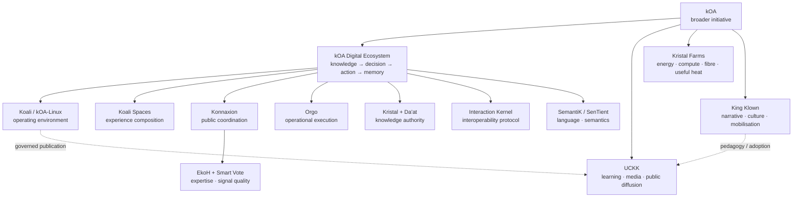

# Réjean McCormick

**Socio-technical architect building kOA — an open, governable infrastructure for turning distributed human knowledge, expertise and effort into collective capacity.**

I work on systems that help people and institutions **find knowledge, mobilize expertise, deliberate, decide, execute, preserve memory, and learn from what happened**.

> **kOA is not a single application.**  
> It is a broader initiative connecting digital infrastructure, learning and knowledge diffusion, physical infrastructure research, multilingual systems, and cultural mobilisation.

The underlying idea is simple:

> **Humanity already possesses enormous knowledge, expertise, creativity and willingness to contribute.  
> The missing infrastructure is the one that allows these resources to be discovered, connected, evaluated, credited, transformed into decisions, carried into action, and preserved as collective memory.**

---

## Start here

### kOA Reference Corpus

The **kOA Reference Corpus** is the main map of the initiative.

It explains the architecture, concepts, systems, authority boundaries, knowledge model, expertise mechanisms, sovereignty principles, learning infrastructure, cultural layer, physical infrastructure, deployment model, and links directly to authoritative technical documentation in the relevant repositories.

➡️ [**Explore the kOA Reference Corpus**](reference-corpus/README.md)

For current implementation state, the corpus links directly to living `docs/status/` directories and equivalent status sources instead of duplicating release information here.

---

## kOA at a glance

---

## The central problem

Modern societies face a paradox of abundance.

We have more information, expertise, communication capacity and computational power than ever before, yet our ability to convert that abundance into **coherent collective action** remains weak.

Knowledge is fragmented. Expertise is distributed. Participation often ends before execution. Decisions lose their reasons. Institutions repeatedly relearn what they once knew.

The problem is therefore not merely informational. It is infrastructural.

A capable collective needs continuity between:

**Sources → Knowledge → Deliberation → Decision → Execution → Results → Lessons → Memory**

or, more simply:

> **Know → Choose → Act → Remember → Know better**

---

## Expertise as public wealth

One of the central premises of kOA is that **expertise is an underused form of collective wealth**.

Expertise exists among researchers, public servants, professionals, tradespeople, creators, community members, people with lived experience, students, specialists, and people whose competence has never been formally recognized.

Some expertise is common. Some is rare. Some is certified. Some becomes visible only through repeated high-quality contributions.

A leader cannot be an expert in everything. A better system therefore does not attempt to manufacture omniscient leaders. It builds infrastructure capable of helping legitimate decision-makers identify relevant knowledge, find relevant competence, compare arguments and evidence, distinguish stronger signals from noise, preserve broad participation, make decisions, connect decisions to execution, and preserve what was learned.

Expertise should improve the quality of advice. It should not silently become political sovereignty.

---

# The kOA Digital Ecosystem

The **kOA Digital Ecosystem** is the digital sociotechnical infrastructure within the broader kOA initiative.

Its purpose is to connect functions that are usually separated across organizations and software:

- knowledge;
- expertise;
- deliberation;
- decision;
- execution;
- evidence;
- institutional memory.

It is designed as a **system of systems**, not as one monolithic application. Each major component retains explicit authority over its own domain.

---

## Koali / kOA-Linux

**Koali is the operating environment and host authority of the Digital Ecosystem.**

It provides the governable local foundation for identity, trust, policy, privileges, resources, component lifecycle, artifacts, releases, backup, recovery, rollback, deployment profiles, offline continuity and external integration boundaries.

> **Critical local capability should not disappear merely because an external provider, network, cloud service or AI system becomes unavailable.**

Repository: [**kOA-Linux-Koali**](https://github.com/Rejean-McCormick/kOA-Linux-Koali)

Related: [Koali Spaces](https://github.com/Rejean-McCormick/Koali-Spaces) · [Koali Control Panel](https://github.com/Rejean-McCormick/Koali-Control-Panel) · [LevelUpDiag-kOA-Linux](https://github.com/Rejean-McCormick/LevelUpDiag-kOA-Linux)

---

## Konnaxion

**Konnaxion is the civic, public and collaborative coordination layer.**

It brings together public consultation, deliberation, collective knowledge, learning, research, innovation, culture, community coordination, team formation, expertise and Smart Vote.

Repository: [**Konnaxion**](https://github.com/Rejean-McCormick/Konnaxion)  
Public surface: [**konnaxion.com**](https://konnaxion.com)

Related: [Konnaxion-Worlds](https://github.com/Rejean-McCormick/Konnaxion-Worlds) · [Konnaxion-Capsule-Manager](https://github.com/Rejean-McCormick/Konnaxion-Capsule-Manager) · [Konnaxion-SecurityDiag](https://github.com/Rejean-McCormick/Konnaxion-SecurityDiag) · [Konnaxion-LevelUpDiag](https://github.com/Rejean-McCormick/Konnaxion-LevelUpDiag)

### EkoH + Smart Vote

EkoH and Smart Vote address a difficult problem:

> **How can broad participation remain visible while stronger domain-relevant expertise is also allowed to emerge?**

**EkoH** models signals of domain-specific competence, contribution quality and ethical credibility. Competence is contextual: someone can be highly competent in one domain without acquiring a universal social rank.

**Smart Vote** preserves an ordinary participation baseline while allowing additional transparent readings informed by relevant competence and ethical credibility.

The purpose is not to create an unquestionable expert class. It is to make stronger evidence, relevant expertise, disagreement, emerging competence and potentially higher-quality contributions more visible without erasing the public baseline.

---

## Orgo

**Orgo is the operational execution authority.**

> **Signal → Case → Workflow → Task → Result → Evidence**

Orgo turns decisions, signals and operational needs into structured work: cases, tasks, ownership, routing, roles, escalation, workflows, execution, review cycles and operational memory.

Repository: [**Orgo**](https://github.com/Rejean-McCormick/Orgo)  
Related: [Orgo-Worlds](https://github.com/Rejean-McCormick/Orgo-Worlds) · [LevelUpDiag-Orgo](https://github.com/Rejean-McCormick/LevelUpDiag-Orgo)

---

## Kristal + Da'at

**Kristal is structured knowledge infrastructure.**

A knowledge artifact can preserve claims, sources, provenance, uncertainty, semantic relationships, validation state, authority, version history and canonical identity.

The objective is to make knowledge portable, inspectable, reusable, auditable and machine-readable without becoming machine-controlled.

Repository: [**Kristal-Framework**](https://github.com/Rejean-McCormick/Kristal-Framework)

**Da'at** is the adaptation boundary between Kristal and the Interaction Kernel, preventing the transport protocol from becoming the authority that determines what knowledge means or whether it is valid.

---

## Interaction Kernel

The **Interaction Kernel** is a distributed interoperability protocol for autonomous systems.

It standardizes Commands, Queries, Events, Receipts, Query Results, artifact exchange, profiles, reliable delivery and reconciliation.

The objective is to let systems cooperate **without giving one system direct ownership of another system's domain**.

Repository: [**Interaction-Kernel**](https://github.com/Rejean-McCormick/Interaction-Kernel)

---

# Building with AI without building authority into AI

kOA is not designed around an AI sovereign.

Its critical architecture favors deterministic, inspectable and governable behavior where authority matters.

AI can assist with exploration, summarization, translation, writing, code, media, research, prototyping and candidate generation. But probabilistic output should not automatically become truth, policy, authorization, identity, canonical memory or political authority.

> **Use AI where it accelerates. Preserve determinism where it protects.**

---

# Offline continuity and sovereignty

A critical digital system should not assume that the public Internet, a cloud provider or an external AI service will always remain available, affordable, trustworthy, uncensored, uncompromised or politically accessible.

Koali therefore treats offline continuity as an architectural concern.

This is **resilience through reduced dependency**, not a claim of invulnerability.

---

# Independent instances, common protocols

The architecture is intended to scale by composition:

**one person → one team → one community → one school → one municipality → one university → one organization → one government → an international network**

The objective is not to centralize everyone into a single kOA database.

> **sovereign instances + common protocols + portable artifacts**

Independent institutions can retain local governance while remaining interoperable.

---

# Koali Scenario Mosaic

The **Koali Scenario Mosaic** maps the architecture across a broad field of applications.

**120 scenarios · 24 reusable patterns · 8 application families**

The scenarios are architecture and use-case mappings; they should not be confused with 120 production deployments.

Explore: [**Koali Scenario Mosaic**](https://koaliscenariomosaic.netlify.app/en/uses/)  
Repository: [**Koali-Scenario-Mosaic**](https://github.com/Rejean-McCormick/Koali-Scenario-Mosaic)

---

# UCKK

**UCKK is the learning, media and public-diffusion branch of the broader kOA initiative.**

Its current implementation is built on Moodle and extends it with structures for learning pathways, courses, challenges, assemblies, archives, integrity workflows, reporting, public knowledge diffusion and an advanced Mediatheque.

UCKK can operate as a standalone learning environment. It is **not a required runtime dependency of the kOA Digital Ecosystem**.

Repository: [**UCKK**](https://github.com/Rejean-McCormick/UCKK)  
Public instance: [**uckk.org**](https://uckk.org)  
Related: [**UCKK-Assets**](https://github.com/Rejean-McCormick/UCKK-Assets)

---

# King Klown

**King Klown is the narrative and mobilisation layer of part of the kOA initiative and UCKK.**

King Klown is not a technical authority, a sovereign, a replacement for institutional governance, or a source of truth about implementation state.

The character exists to attract attention, reveal systems, expose absurdities, ask uncomfortable questions, turn abstract ideas into memorable scenes, create challenges, transform attention into learning, and transform learning into action.

Repository: [**King-Klown-Canon**](https://github.com/Rejean-McCormick/King-Klown-Canon)

### Surreality

> **Real problem → symbolic or fictional scene → possible resolution → return to reality**

The fiction is not intended to replace factual truth. It is a method for making difficult or abstract systems understandable, memorable and culturally transmissible.

---

# Kristal Farms

**Kristal Farms is separate from the Kristal knowledge system.**

It explores a physical infrastructure model connecting renewable energy, cold-climate compute, fibre, useful heat, resilient local infrastructure, community value and transferable expertise.

> **Kristal Farms operates the infrastructure. The tenant controls the compute.**

Repository: [**Kristal-Farms**](https://github.com/Rejean-McCormick/Kristal-Farms)

---

# Language and semantic infrastructure

## SemantiK Architect

**SemantiK Architect** explores structured multilingual natural-language generation.

Repository: [**SemantiK-Architect**](https://github.com/Rejean-McCormick/SemantiK-Architect)

Related: [GF Zone Auditor](https://github.com/Rejean-McCormick/SemantiK-Architect-GF-Zone-Auditor) · [Grammatical-Framework-audit](https://github.com/Rejean-McCormick/Grammatical-Framework-audit)

## SenTient

**SenTient** explores structured semantic interpretation and reconciliation of language into entities and relations.

Repository: [**SenTient**](https://github.com/Rejean-McCormick/SenTient)

---

# Supporting language-engineering ecosystem

The GF/RGL engineering systems under [MA-Gustave](https://github.com/MA-Gustave) are modeled as an **independent supporting ecosystem**, not as members of the kOA Digital Ecosystem. GF remains the external linguistic execution authority; GF RGL AI Compendium governs source-grounded engineering context, GF Wordbench produces validation evidence, Ars Magna Lulli orchestrates portfolio workflows, and GF Observatory projects maturity/readiness evidence.

> **Support is not membership, and integration does not transfer authority.**

# Public good, without economic lock-in

The underlying software and knowledge infrastructure are intended to remain broadly inspectable and self-hostable.

That does not prevent sustainable economic activity. Organizations can pay for deployment, hosting, integration, configuration, migration, maintenance, support, managed infrastructure, SLA, educational deployment, media migration and physical infrastructure.

> **Pay for service, not permission.**

---

# Current implementation state

This profile deliberately does **not** duplicate maturity percentages, release numbers or temporary engineering status. Those change faster than this overview should.

For current status, qualification evidence and release information, follow the live status sources linked throughout the:

➡️ [**kOA Reference Corpus**](reference-corpus/README.md)

---

# Repository map

## Core architecture
- [kOA-Digital-Ecosystem](https://github.com/Rejean-McCormick/kOA-Digital-Ecosystem)
- [kOA-Linux-Koali](https://github.com/Rejean-McCormick/kOA-Linux-Koali)
- [Koali-Spaces](https://github.com/Rejean-McCormick/Koali-Spaces)
- [Interaction-Kernel](https://github.com/Rejean-McCormick/Interaction-Kernel)

## Civic and operational systems
- [Konnaxion](https://github.com/Rejean-McCormick/Konnaxion)
- [Konnaxion-Worlds](https://github.com/Rejean-McCormick/Konnaxion-Worlds)
- [Konnaxion-Capsule-Manager](https://github.com/Rejean-McCormick/Konnaxion-Capsule-Manager)
- [Konnaxion-SecurityDiag](https://github.com/Rejean-McCormick/Konnaxion-SecurityDiag)
- [Konnaxion-LevelUpDiag](https://github.com/Rejean-McCormick/Konnaxion-LevelUpDiag)
- [Orgo](https://github.com/Rejean-McCormick/Orgo)
- [Orgo-Worlds](https://github.com/Rejean-McCormick/Orgo-Worlds)

## Knowledge and semantics
- [Kristal-Framework](https://github.com/Rejean-McCormick/Kristal-Framework)
- [SemantiK-Architect](https://github.com/Rejean-McCormick/SemantiK-Architect)
- [SenTient](https://github.com/Rejean-McCormick/SenTient)

## Learning and public diffusion
- [UCKK](https://github.com/Rejean-McCormick/UCKK)
- [UCKK-Assets](https://github.com/Rejean-McCormick/UCKK-Assets)

## Narrative and mobilisation
- [King-Klown-Canon](https://github.com/Rejean-McCormick/King-Klown-Canon)

## Physical infrastructure
- [Kristal-Farms](https://github.com/Rejean-McCormick/Kristal-Farms)

## Scenario mapping
- [Koali-Scenario-Mosaic](https://github.com/Rejean-McCormick/Koali-Scenario-Mosaic)

## Public documentation
- [initkoa-docs](https://github.com/Rejean-McCormick/initkoa-docs)
- [HomePage-initkoa.org](https://github.com/Rejean-McCormick/HomePage-initkoa.org)

---

# Why this work exists

The objective is not simply to build more software. It is to improve society's ability to **think and act together**.

A functioning collective infrastructure should make it easier to find the right knowledge, hear the right expertise, preserve disagreement without drowning in noise, make decisions with visible reasons, connect decisions to real responsibility, execute, preserve evidence, learn, recognize contributors, and make future action better.

> **A society should become more capable every time it solves a problem.**

---

# Explore

### Main hub
[**initkoa.org**](https://initkoa.org)

### Reference Corpus
[**kOA Reference Corpus**](reference-corpus/README.md)

### Public systems
- [Konnaxion](https://konnaxion.com)
- [UCKK](https://uckk.org)
- [Koali Scenario Mosaic](https://koaliscenariomosaic.netlify.app/en/uses/)

### Research and writing
- [Medium](https://medium.com/@boatbuilder610)
- [Google Scholar](https://scholar.google.com/citations?user=oVZ3n9kAAAAJ&hl=en)
- [ORCID](https://orcid.org/0009-0001-2086-854X)
- [PhilPeople](https://philpeople.org/profiles/rejean-mccormick)
- [Amazon author page](https://www.amazon.ca/stores/author/B0G3B7DQWG?ingress=0)

### Public presence
- [LinkedIn](https://www.linkedin.com/in/r%C3%A9jean-mccormick-51403a37b/)
- [YouTube](https://www.youtube.com/@KingKlown-XYZ/playlists)

---

# Contact

**Réjean McCormick**

- Email: [rejean.mccormick@initkoa.org](mailto:rejean.mccormick@initkoa.org)
- GitHub: [Rejean-McCormick](https://github.com/Rejean-McCormick)
- Hub: [initkoa.org](https://initkoa.org)

---

> **Know. Choose. Act. Remember. Know better.**
