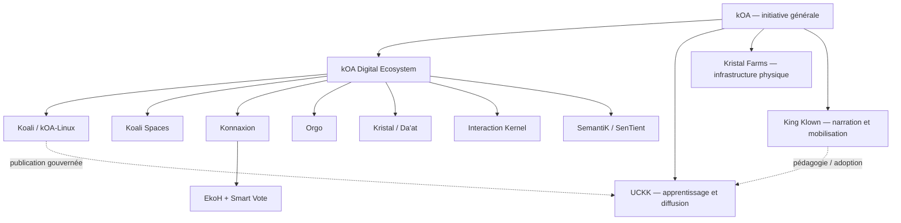

# kOA Reference Corpus

## Carte générale de l’initiative kOA

Ce wiki est la **carte de lecture du corpus kOA**. Il ne remplace pas les dépôts techniques, leurs contrats, leurs tests ni leurs documents normatifs. Il relie les concepts, les systèmes et les corpus afin qu’une personne puisse comprendre l’ensemble sans devoir deviner comment les pièces s’emboîtent.

> **kOA est une architecture pour transformer des connaissances, des expertises et des efforts humains distribués en capacité collective.**

La boucle directrice est simple :

**Connaître → Choisir → Agir → Se souvenir → Mieux connaître**

Le problème traité n’est pas seulement l’accès à l’information. Une société peut disposer d’une immense quantité de savoir et rester faible si elle ne sait pas **trouver l’expertise pertinente, distinguer le signal du bruit, relier la connaissance à la décision, transformer la décision en action et conserver ce qui a été appris**.

## Carte du corpus

## Cinq ensembles à ne pas confondre

| Ensemble | Fonction principale |
|---|---|
| **kOA** | Initiative générale : architecture sociale, technique, éducative, physique et culturelle. |
| **kOA Digital Ecosystem** | Infrastructure sociotechnique : connaissance, délibération, décision, exécution et mémoire. |
| **UCKK** | Infrastructure d’apprentissage, de médiathèque, de création et de diffusion. |
| **Kristal Farms** | Modèle d’infrastructure physique : énergie, calcul, fibre, chaleur utile et autonomie territoriale. |
| **King Klown** | Couche narrative et de mobilisation : récits, chansons, théâtre public et transmission culturelle. |

## Commencer ici

1. [Guide de lecture](Guide-de-lecture.md)
2. [L’initiative kOA](01-Initiative-kOA.md)
3. [Le problème de capacité collective](02-Probleme-capacite-collective.md)
4. [Expertise, signal et intelligence collective](03-Expertise-et-signal.md)
5. [Le kOA Digital Ecosystem](04-Ecosysteme-Digital-kOA.md)
6. [Carte des sources et autorité documentaire](23-Sources-et-autorite.md)

## Surfaces publiques

- [initkoa.org](https://initkoa.org)
- [Konnaxion](https://konnaxion.com)
- [UCKK](https://uckk.org)
- [Koali Scenario Mosaic](https://koaliscenariomosaic.netlify.app/en/uses/)
- [Dépôts publics de Réjean McCormick](https://github.com/Rejean-McCormick)

## Documents de référence

- [kOA Digital Ecosystem — index](https://github.com/Rejean-McCormick/kOA-Digital-Ecosystem/blob/main/docs/index.md)
- [kOA Digital Ecosystem — Layer Model](https://github.com/Rejean-McCormick/kOA-Digital-Ecosystem/blob/main/docs/3-Layer-Model/LAYER_MODEL.md)
- [Koali / kOA-Linux — documentation](https://github.com/Rejean-McCormick/kOA-Linux-Koali/blob/main/docs/README.md)
- [Konnaxion — documentation](https://github.com/Rejean-McCormick/Konnaxion/blob/main/docs/README.md)
- [Orgo — documentation](https://github.com/Rejean-McCormick/Orgo/blob/master/docs/README.md)
- [Kristal Framework — documentation](https://github.com/Rejean-McCormick/Kristal-Framework/blob/main/docs/index.md)
- [Interaction Kernel — documentation](https://github.com/Rejean-McCormick/Interaction-Kernel/blob/main/docs/README.md)
- [UCKK — architecture de distribution](https://github.com/Rejean-McCormick/UCKK/blob/main/docs/02_distribution_architecture.md)
