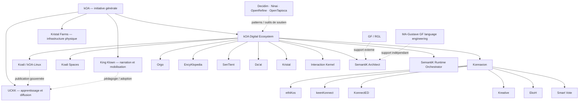

<!-- Synchronisé avec Kristal-kOA-Ecosystem v0.4.0 — 2026-10-02. Ce wiki reste une projection de lecture; les dépôts propriétaires conservent leur autorité. -->

# kOA Reference Corpus

## Carte générale de l’initiative kOA

Ce wiki est la **carte de lecture du corpus kOA**. Il ne remplace pas les dépôts techniques, leurs contrats, leurs tests ni leurs documents normatifs. Il relie les concepts, systèmes, sous-systèmes, utilités et frontières d’autorité afin qu’une personne puisse comprendre l’ensemble sans devoir deviner comment les pièces s’emboîtent.

> **kOA est une architecture pour transformer des connaissances, des expertises et des efforts humains distribués en capacité collective.**

La boucle directrice demeure :

**Connaître → Choisir → Agir → Se souvenir → Mieux connaître**

Le Kristal de synthèse ajoute une autre lecture utile :

**besoin → utilité → workflow potentiel → capacités → composants → artefacts → résultats → mémoire**

Cette deuxième lecture ne remplace pas la première. Elle aide surtout à voir comment plusieurs systèmes peuvent se composer autour d’un problème concret.

## Carte du corpus

## Ensembles à ne pas confondre

| Ensemble | Fonction principale | Relation au Digital Ecosystem |
|---|---|---|
| **kOA** | Initiative générale : architecture sociale, technique, éducative, physique et culturelle. | Contient le Digital Ecosystem mais le dépasse. |
| **kOA Digital Ecosystem** | Infrastructure sociotechnique : connaissance, coordination, délibération, décision, exécution, preuve et mémoire. | Noyau numérique. |
| **UCKK** | Infrastructure d’apprentissage, médiathèque, création et diffusion. | Branche adjacente; peut consommer des projections sans devenir le canon. |
| **Kristal Farms** | Infrastructure physique : énergie, calcul, fibre, chaleur utile et autonomie territoriale. | Branche physique distincte. |
| **King Klown** | Narration, pédagogie et mobilisation culturelle. | Couche narrative, sans autorité technique. |
| **MA-Gustave GF Language Engineering Ecosystem** | Ingénierie, validation, orchestration et observation de langues GF/RGL. | Écosystème de soutien indépendant, pas membre de kOA Digital Ecosystem. |
| **Outils/patterns externes** | GF, Decidim, Ninai, OpenRefine, OpenTapioca, etc. | Soutiennent certaines capacités; support ≠ appartenance. |

## Règles de lecture issues du Kristal

1. **Composant ≠ capacité.** Une capacité peut être fournie par plusieurs composants.
2. **Support ≠ appartenance.** Un outil externe peut être important sans devenir membre du Digital Ecosystem.
3. **Scénario ≠ déploiement.** Les scénarios montrent des compositions possibles, pas des preuves de production.
4. **Projection ≠ autorité.** Une vue, un dashboard ou une projection rebuildable ne devient pas la source canonique.
5. **Décision ≠ exécution.** Konnaxion peut posséder une décision et Orgo son exécution sans fusion des deux autorités.
6. **Actionability ≠ autorité d’exécution.** Un artefact peut indiquer qu’une action est possible sans posséder le droit de l’exécuter.
7. **Maturité non scalaire.** Spécifié, implémenté, qualifié, intégré et éprouvé en production sont des dimensions distinctes.

## Commencer ici

1. [Guide de lecture](Guide-de-lecture.md)
2. [L’initiative kOA](01-Initiative-kOA.md)
3. [Le problème de capacité collective](02-Probleme-capacite-collective.md)
4. [Le kOA Digital Ecosystem](04-Ecosysteme-Digital-kOA.md)
5. [Modèle d’autorité et frontières](05-Modele-autorite-et-frontieres.md)
6. [Utilités et patterns de workflow](26-Utilites-et-workflows.md)
7. [Écosystèmes et outils de soutien](27-Ecosystemes-de-soutien.md)
8. [Artefacts, contrats et lifecycles](28-Artefacts-contrats-lifecycles.md)
9. [Applications adjacentes et outillage](29-Applications-adjacentes-et-outillage.md)
10. [Carte des sources et autorité documentaire](23-Sources-et-autorite.md)

## Synchronisation

Cette édition a été synchronisée avec **Kristal-kOA-Ecosystem v0.4.0**. Le Kristal sert ici de carte de synthèse : il rapproche composants, capacités, besoins, utilités, workflows, contrats, artefacts, lifecycles et sources. Lorsqu’un détail technique précis diverge, **le dépôt propriétaire et ses preuves priment**.

## Surfaces publiques

- [initkoa.org](https://initkoa.org)
- [Konnaxion](https://konnaxion.com)
- [UCKK](https://uckk.org)
- [Koali Scenario Mosaic](https://koaliscenariomosaic.netlify.app/en/uses/)
- [Dépôts publics de Réjean McCormick](https://github.com/Rejean-McCormick)
- [Mécanismes Abstraits par Gustave](https://github.com/MA-Gustave)

## Documents de référence

- [kOA Digital Ecosystem](https://github.com/Rejean-McCormick/kOA-Digital-Ecosystem)
- [Koali / kOA-Linux](https://github.com/Rejean-McCormick/kOA-Linux-Koali)
- [Konnaxion](https://github.com/Rejean-McCormick/Konnaxion)
- [Orgo](https://github.com/Rejean-McCormick/Orgo)
- [Kristal Framework](https://github.com/Rejean-McCormick/Kristal-Framework)
- [Interaction Kernel](https://github.com/Rejean-McCormick/Interaction-Kernel)
- [UCKK](https://github.com/Rejean-McCormick/UCKK)
- [SemantiK Architect](https://github.com/Rejean-McCormick/SemantiK-Architect)
- [GF RGL AI Compendium](https://github.com/MA-Gustave/GF_RGL_AI_Compendium)
- [GF Wordbench](https://github.com/MA-Gustave/GF_Wordbench)
- [GF Observatory](https://github.com/MA-Gustave/GF_Observatory)
- [Ars Magna Lulli](https://github.com/MA-Gustave/Ars-Magna-Lulli)
